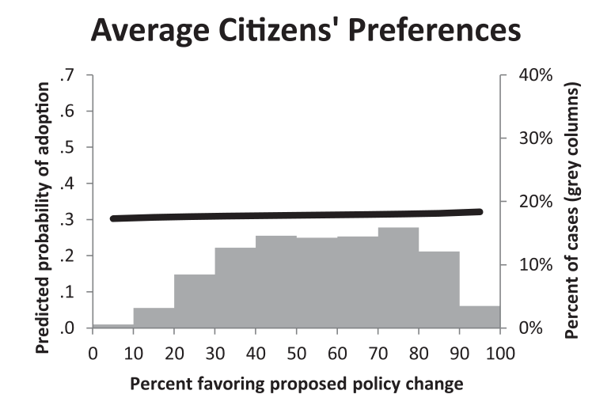
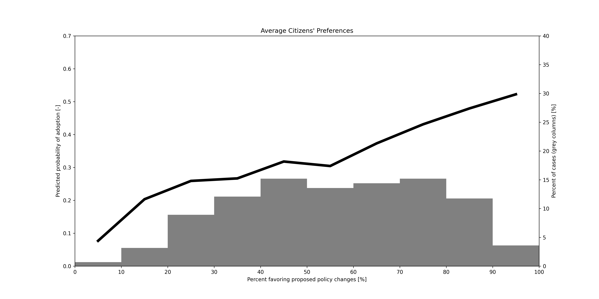
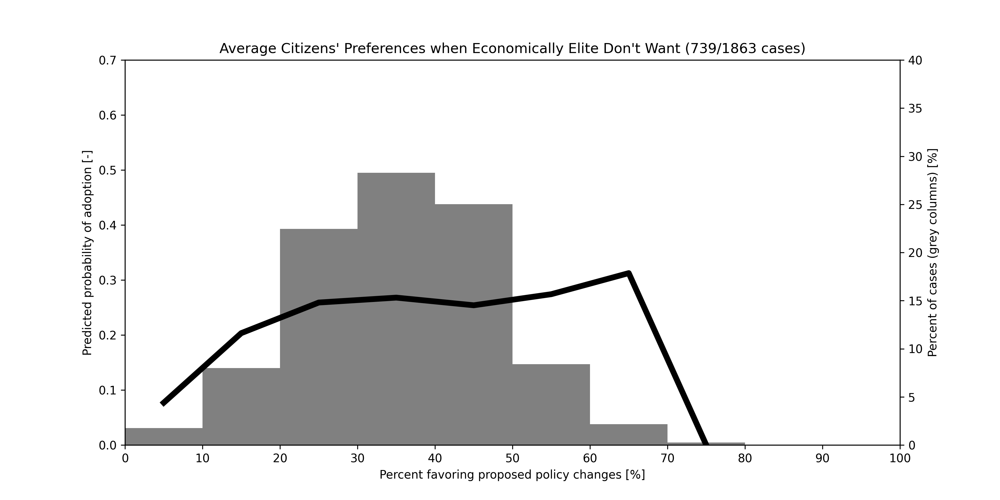
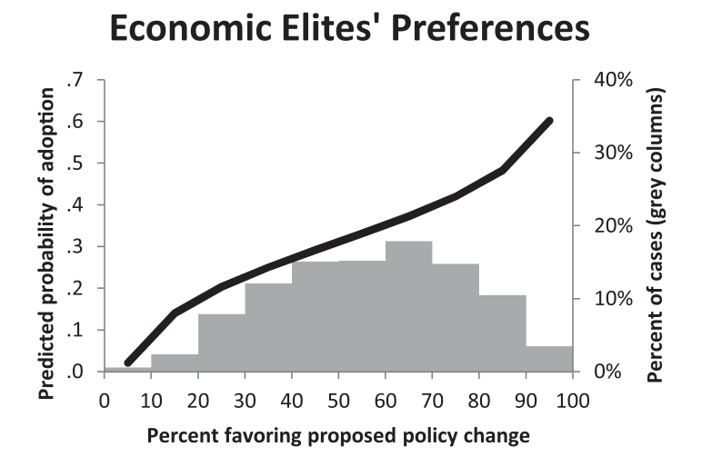
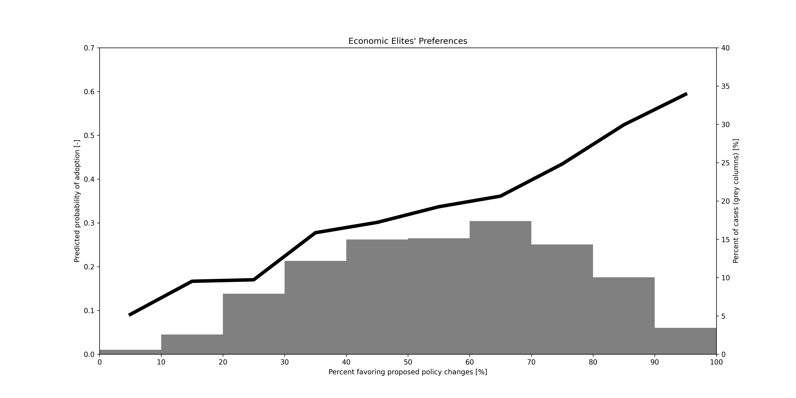
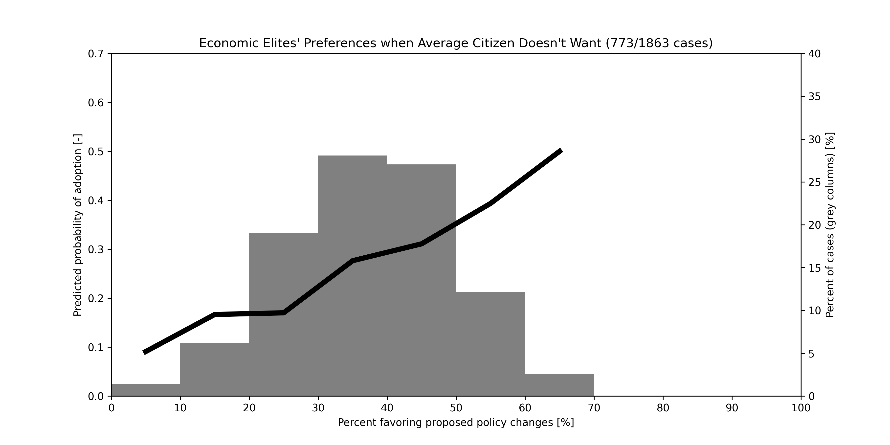
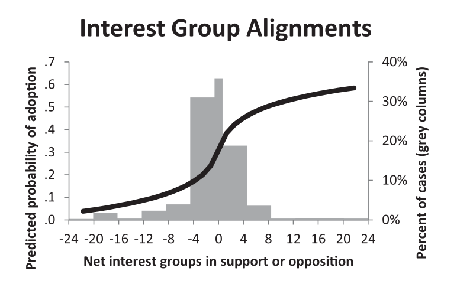
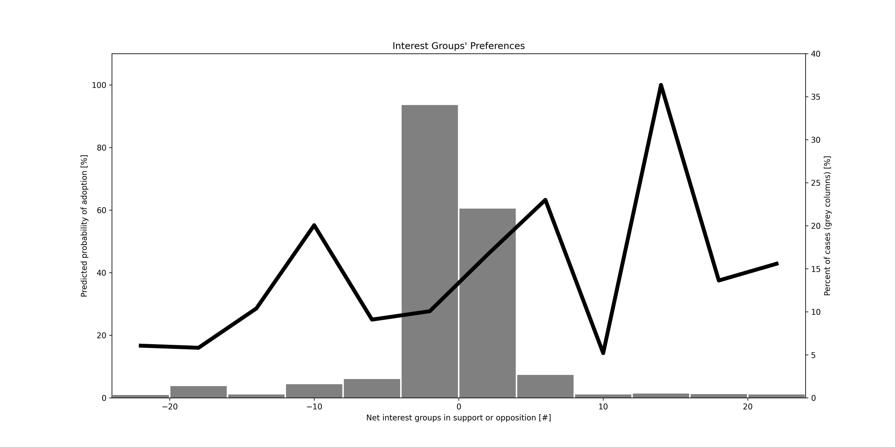
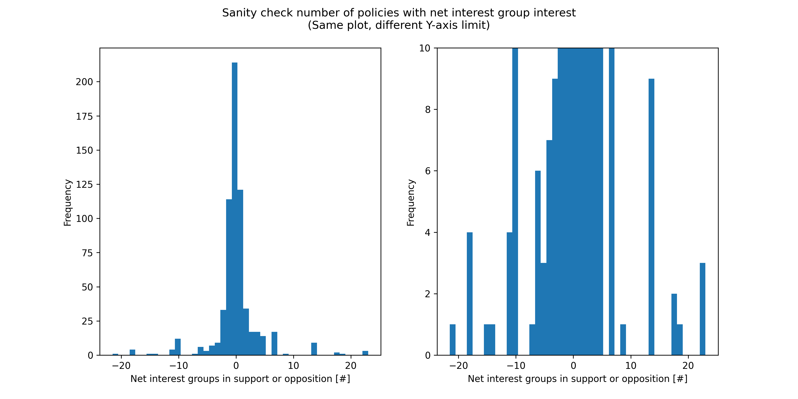

# Data Analysis of: *Testing Theories of American Politics: Elites, Interest Groups, and Average Citizens*, 2014, by Gilens, M. and Page, B.

## Status: **Incomplete**

**Please don't take this as an accusation of academic fraud. Authors used IBM's AMOS statistical software to generate figures and tables. AMOS may have analysis techniques not here explored or may have been incorrectly used/configured. Without a proven trend of falsehoods, it's safer to assume mistake rather than malice. I could also be wrong.**

## TL;DR:
- Paper figures partially replicable
- Those figure parts that can't be replicated are, unfortunately, critical to the central argument of economic influence on policy adoption.
- Strong policy preference correlation (>= 0.85) among all economic classes. If a large proportion of a group is in favor of a piece of legislation, it's more likely to be adopted which is counter to the argument made in the paper.
- Only category investigated (education, income, ideology, political leanings, age) that doesn't have a strong correlation (>= 0.85) in policy preference is ideology/political leaning.

## Replicating Figure 1 (the only figure)
Note:
- Average Citizen is defined as 50th income percentile (income range unknown, pred50_sw in the dataset); Economic Elite is defined as 90th income percentile (>$146,000 in 2012 adjusted dollars, pred90_sw in the dataset)

Critiques:
- Paper states (pg. 573, paragraph 1) that the policy preferences of the 50th and 90th income percentiles are highly correlated but figure 1 doesn't show that to be the case; what the figure purports to plot isn't clear if that correlation isn't there. If the two are highly correlated, they should look similar. If further processing was used to differentiate them, that should be clearly stated.
- Paper states (pg. 573, 2 paragraphs above Economic Elites) that the 80% policy adoption preference bracket (grey bar) for average citizens got their policy adopted 43% of the time. That matches this analysis' recalculation but not figure 1a. This is further evidence of a different analysis method used to generate 1a and 1c but the method isn't clearly stated. Even after corresponding with authors that isn't the case.
- Figure 1b is almost exactly replicated which lends some credence to this analysis' methods.
- Very few cases of +-6 net interest groups for figure 1c such that the predicted probability of adoption is very noisy. Certainly no nearly-perfectly smooth logistic curve can be fit to the data. Similarly to 1a, if a different method of analysis was performed to generate pseudo-data or smooth, that should be clearly stated.
- Sharp spike in Percent of cases (grey columns) for figure 1c replicated by making smaller histogram bins. It is tightly clustered about 0.
- Overall, the figure caption is insufficient to explain itself either in conclusion or analysis methods. Given that this is the only figure and has been used out of context (granted, there's no way for the authors to know that ahead of time), the lack of clarity is disturbing.

### Comparisons
#### Average Citizens' Preferences
##### Paper

##### Recalculation

##### After Author's Feedback

##### Comparison
- Percent of cases successfully replicated but predicted probability of adoption isn't.
- Even after correction applied after reaching out to authors, figure diverges even more strongly.
- Predicted probability of adoption here shown leads to no conclusion about the result of conflicting preferences. So few data are present for the case where the economic elites disagree that the percent of cases is no longer normal about approximately 50%.

#### Economic Elites' Preferences
##### Paper

##### Recalculation

##### After Author's Feedback

##### Comparison
- Predicted probability much closer to the paper; it's not perfect but it's pretty close.
- If author's method is applied, similarly to the average citizens' preference, there are too few cases. If we compare to the average citizens' preference numerically, we can see there is an approximately 10% difference in probability of adoption but without more data, that doesn't meet a reasonable p-threshold for significance and it certainly doesn't meet p < 0.001 that the authors originally showed.

#### Interest Group Alignments
##### Paper

##### Recalculation

##### Number of Cases with Varying Interest Group Alignments

##### Comparison
- Far too few data outside high-density region as shown in "Number of Cases with Varying Interest Group Alignments". Paper's perfect logistic curve must be a numerical artifact from AMOS. 
- Plotting the data present shows little obvious trend outside of the high density region.

---
Additional analysis available in the "Additional Analysis" section of `code/analysis.ipynb`.

Data and supplemental materials available in `data`.

Original paper and a note on R-sq calculations available in `papers`.

Paper and the data also available at [cambridge.org, doi:10.1017/S1537592714001595](https://doi.org/10.1017/S1537592714001595)

Additional R script used to perform a similar analysis used in Alex Branhman's paper, *Replication Data for: When do the Rich Win* ([doi:10.7910/DVN/UZSQTV](https://dataverse.harvard.edu/dataset.xhtml?persistentId=doi:10.7910/DVN/UZSQTV)), can be found in `additional-author-correspondence`

Many thanks to Marty Gilens for responding to my request for data and calculation clarification.